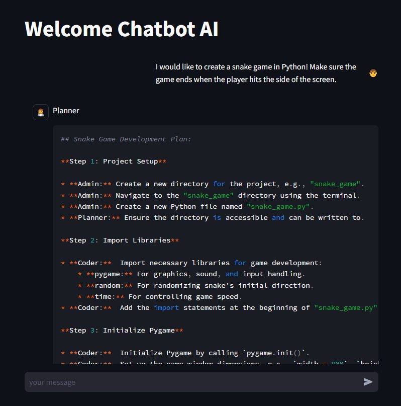
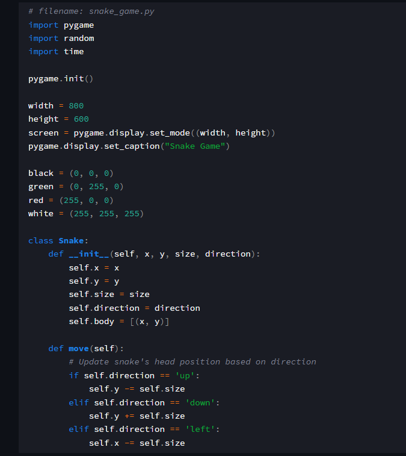
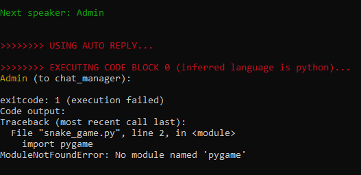

# Project Description:
**This project helps everyone to easily access AI to help work become faster. Everyone just needs to enter their to-do tasks, AI will divide that work into small parts and perform the result you get is a smooth product without any errors.**

- First, everyone enter everyone's request

- Next, a technique like AI will plan each step to complete the job.

- There will be an AI engineer assigned to code based on the given plan.

- Then AI admin will run test in docker environment

- If the code has an error, the admin will send it back to the coder to fix it.

- The file will be saved to the user specified directory and the output is that everyone just needs to run
 

